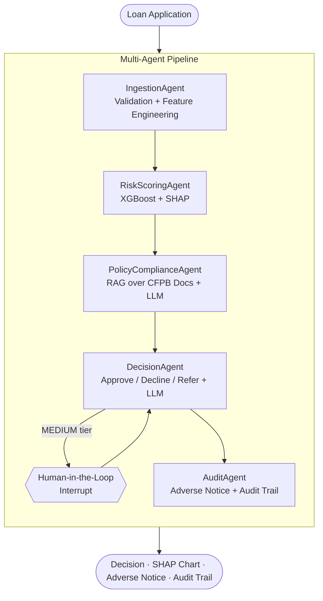

# CredAgent 🏦

> **Agentic Credit Decisioning & Risk Explainability System**

[](https://ethanjgithub-credagent-streamlit-app-kruhoy.streamlit.app/)
[](https://python.org)
[](https://langchain-ai.github.io/langgraph/)
[](https://xgboost.readthedocs.io)
[](tests/)
[](LICENSE)

A multi-agent AI pipeline for real-time loan underwriting in employer-sponsored
installment lending, modeled on the underwriting needs of platforms like
Purchasing Power / PROG Holdings. It scores an application with a gradient-boosted
risk model, explains every prediction with SHAP, checks the decision against CFPB
fair-lending regulations via RAG, routes borderline cases to a human reviewer, and
generates a legally-compliant adverse-action notice — in well under a second.

**[→ Try the live demo](https://ethanjgithub-credagent-streamlit-app-kruhoy.streamlit.app/)** — the trained model and CFPB vector store ship with the repo, so it runs with no setup or dataset download.

---

## What It Does

In a single API call, CredAgent runs a five-agent [LangGraph](https://langchain-ai.github.io/langgraph/) pipeline:

1. **IngestionAgent** — validates and enriches the application (debt-to-income, employment length, credit ratios).
2. **RiskScoringAgent** — scores default risk with **XGBoost (held-out ROC-AUC 0.78 / 5-fold CV 0.7818 on the full real Home Credit relational dataset)** and attributes the prediction with **SHAP**.
3. **PolicyComplianceAgent** — retrieves relevant CFPB fair-lending text from a **ChromaDB** vector store and uses an LLM to flag disparate-impact / ECOA / FCRA concerns.
4. **DecisionAgent** — issues **APPROVE / DECLINE / REFER** with plain-English reasoning; **MEDIUM-risk** cases pause for **human-in-the-loop** review.
5. **AuditAgent** — generates a **CFPB-compliant adverse-action notice** (ECOA §1002.9) for declines and assembles a timestamped audit trail.

---

## Architecture



---

## Tech Stack

| Component | Technology |
|---|---|
| Agent orchestration | LangGraph 0.2 (stateful graph + MemorySaver checkpointing for HITL) |
| LLM (reasoning + compliance) | Pluggable: **Groq / Llama 3** or **Anthropic Claude**, with a deterministic offline fallback |
| ML risk model | XGBoost 2.0 (gradient-boosted trees) |
| Explainability | SHAP TreeExplainer (per-prediction feature attribution) |
| Regulatory RAG | ChromaDB + ONNX `all-MiniLM-L6-v2` embeddings |
| API | FastAPI + Pydantic v2 |
| Frontend | **React (Vite) + Nivo charts** (decoupled SPA on the API) |
| Decision store | SQLite — every decision persisted for audit + monitoring |
| Dashboard (alt) | Streamlit (+ SHAP waterfall via matplotlib) |
| Dataset | **Home Credit Default Risk — real 307,511-row dataset** |
| Compliance corpus | ECOA / Regulation B §1002.9, FCRA §615, CFPB fair-lending & BNPL material |

---

## Model Performance

| Metric | Value |
|---|---|
| Algorithm | XGBoost (gradient-boosted trees, early stopping, ~1.2k trees) |
| Training data | **Full Home Credit relational dataset** — application + bureau, previous applications, installments, POS & credit-card history (246k train / 61.5k validation) |
| **Held-out ROC-AUC** | **0.7815** — consistent with **5-fold CV 0.7818 ± 0.0030** |
| Features | **81** — 44 application-level + 37 relational-history aggregations (sex, education **and** geography excluded — see below) |
| Class handling | `scale_pos_weight ≈ 11.3` (8.1% default base rate) |
| Explainability | SHAP — per-prediction feature attribution |
| End-to-end latency | ~0.4 s (offline reasoning) / ~1–2 s (with LLM) |

**Why 0.78, and why this is the honest number.** An application-table-only model
plateaus around **0.76** (external bureau scores dominate and more application
features add little — we measured 0.765 with 45 tuned application features). The
lift to **0.7815** comes from doing what a real lender does: aggregating the
applicant's **credit-bureau history, prior applications, and installment-payment
behaviour** (days-past-due, payment shortfalls, refusal rates). We deliberately
**exclude geography/region** features (a redlining / location-based disparate-impact
proxy) alongside sex and education, which costs a little AUC versus uncapped Kaggle
leaderboard solutions — a trade we make on purpose for fair-lending defensibility.

> **Demo vs. evaluation (stated plainly).** The AUC above is measured on real
> applicants *with* their real relational history. The interactive demo form
> can't pull a stranger's credit history, so those 37 auxiliary features are
> imputed to training medians at demo time (the application-level inputs you set —
> external scores, amounts, employment — drive the live prediction). Adverse-action
> reasons cite **only** the applicant-provided application features, never an
> imputed history feature. See [COMPLIANCE.md](COMPLIANCE.md).

The trained model card is in [`models/model_metadata.json`](models/model_metadata.json), which records the data source, feature set, and `trained_on_real_data` / `uses_relational_features` flags for full transparency.

---

## Quickstart (Local)

```bash
git clone https://github.com/EthanJGithub/CredAgent.git
cd CredAgent
python -m venv .venv && . .venv/Scripts/activate    # Windows
pip install -r requirements.txt

# (Optional) add a free Groq key for LLM-authored text; runs fine without one.
cp .env.example .env

# 1. Fetch the REAL Home Credit dataset (auto-downloads ~40 MB, no Kaggle account)
python -m src.ml.get_data

# 2. Train the XGBoost + SHAP model (~1–2 min)
python -m src.ml.train

# 3. Build the CFPB regulatory vector store (~1 min)
python -m src.rag.ingest

# 4a. Run the API
uvicorn src.api.main:app --reload          # http://localhost:8000/docs

# 4b. Run the dashboard (separate terminal)
streamlit run src/dashboard/app.py         # http://localhost:8501

# Tests
pytest                                       # 18 passing
```

> The repo ships with the trained `models/` and `vectorstore/` committed, so the
> Streamlit Cloud demo (and `streamlit_app.py`) work without steps 1–3.

### Data sourcing

`python -m src.ml.get_data` prefers **real data** in this order: an existing real
CSV at `data/raw/application_train.csv` → the public HuggingFace mirror of the
genuine Home Credit dataset → the Kaggle API (if credentials are configured) →
a clearly-flagged synthetic fallback used only when fully offline. The model in
this repo was trained on the **real** dataset.

---

## API

| Method | Endpoint | Purpose |
|---|---|---|
| `GET`  | `/api/v1/health` | Service + model + vectorstore status |
| `POST` | `/api/v1/decisions` | Submit an application for decisioning |
| `GET`  | `/api/v1/decisions/{id}` | Retrieve a prior decision |
| `POST` | `/api/v1/decisions/{id}/human-review` | Submit a reviewer's decision for a REFER case |
| `GET`  | `/api/v1/model/info` | Model version, features, training AUC, thresholds |
| `GET`  | `/api/v1/monitoring/summary` | Portfolio metrics + fair-lending disparate-impact analysis |
| `GET`  | `/api/v1/monitoring/decisions` | Recent decisions (audit table) |
| `GET`  | `/api/v1/monitoring/export.csv` | Full decision log as CSV (regulatory export) |

---

## Frontend (React + Nivo)

A decoupled single-page app in [`frontend/`](frontend/) (React + Vite, [Nivo](https://nivo.rocks) charts) consumes the FastAPI API. Two views:

- **Score an Applicant** — form with real-applicant presets, decision badge, and tabs for the **Nivo SHAP bar**, compliance, the adverse-action notice, and the audit trail. Human-in-the-loop review is handled inline for MEDIUM-tier cases.
- **Portfolio Monitoring** — Nivo pie (decision mix) + bars (risk-tier distribution, approval rate by group) over every persisted decision, with a **fair-lending disparate-impact panel** and CSV export.

```bash
# Terminal 1 — API
uvicorn src.api.main:app --reload            # http://localhost:8000

# Terminal 2 — frontend (Node 18+)
cd frontend && npm install && npm run dev      # http://localhost:5173 (proxies /api → :8000)
```

Deploy: `npm run build` produces static assets for Vercel/Netlify; set `VITE_API_BASE` to the hosted API origin (CORS is open on the backend). The Streamlit app remains an alternate zero-frontend demo.

### Portfolio Monitoring & Fair Lending

Every decision is persisted to a SQLite store ([`src/store.py`](src/store.py)) and the store is seeded on first run with 600 real applicants ([`src/seed_history.py`](src/seed_history.py)) so the dashboard has volume immediately. The monitoring view runs a **four-fifths (80%) rule** disparate-impact test across gender groups. Because gender is *excluded from the model*, any disparity reflects **disparate impact** from correlated permissible features — exactly the separation a real fair-lending team maintains between scoring and monitoring.

---

## Compliance Framework

The `PolicyComplianceAgent` and `AuditAgent` apply guidance retrieved at inference time:

- **ECOA / Regulation B (12 CFR 1002.9)** — adverse-action notice with *specific* principal reasons.
- **FCRA §615 (15 U.S.C. 1681m)** — consumer-report adverse-action duties.
- **CFPB fair-lending principles** — disparate treatment vs. disparate impact; model-risk expectations for algorithmic underwriting.
- **CFPB BNPL market report** — installment-lending regulatory context.

Protected-class attributes and their close proxies are excluded from the decision; adverse-action reasons are derived from SHAP attributions over permissible financial factors.

---

## Project Structure

```
credagent/
├── streamlit_app.py          # Streamlit Cloud entry point (runs pipeline inline)
├── frontend/                 # React (Vite) + Nivo single-page app
│   └── src/                  # api client, ApplicantForm, DecisionResult, ShapBar, Monitoring
├── src/
│   ├── agents/               # 5 LangGraph agents
│   ├── graph/                # State schema + workflow (HITL checkpointing)
│   ├── ml/                   # get_data, features, train, explainer
│   ├── rag/                  # CFPB corpus, ChromaDB ingest + retriever
│   ├── api/                  # FastAPI app, routes, schemas (+ monitoring endpoints)
│   ├── dashboard/            # Streamlit (connects to FastAPI)
│   ├── store.py              # SQLite decision store + disparate-impact analysis
│   ├── seed_history.py       # Seed 600 real applicants for monitoring
│   ├── llm.py                # Pluggable Groq/Anthropic/offline LLM
│   └── demo_presets.py       # Real applicants for the demo tiers
├── data/sample_applicants.csv# 600 real applicants (committed) for seeding
├── models/                   # Trained XGBoost + SHAP + metadata (committed)
├── vectorstore/              # ChromaDB CFPB embeddings (committed)
└── tests/                    # pytest suite (18 tests)
```

---

## Notable Engineering Decisions

- **Real data, automatically.** `get_data.py` pulls the genuine 307K-row Home Credit application table **and the full relational tables** (bureau, previous applications, installments, POS, credit card) from public mirrors — no Kaggle gate — and records provenance in the model card. The large raw tables are gitignored; only the trained model + `feature_medians.json` ship.
- **Runs with zero API keys.** The LLM layer degrades gracefully to deterministic, template-based reasoning so the full pipeline (and CI) never blocks on a credential or rate limit.
- **Lightweight embeddings.** ChromaDB's ONNX `all-MiniLM-L6-v2` avoids a ~2 GB PyTorch dependency, keeping installs and cloud deploys fast.
- **Stateful HITL.** LangGraph's `MemorySaver` checkpointer lets a MEDIUM-tier decision pause and resume on the same `thread_id` when a human ruling arrives.

---

## License

MIT — see [LICENSE](LICENSE).
